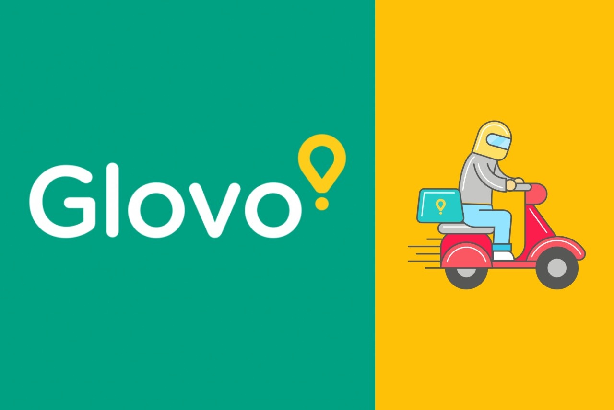
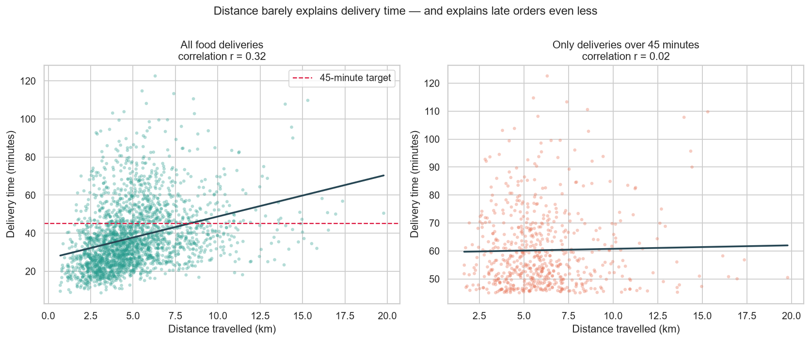
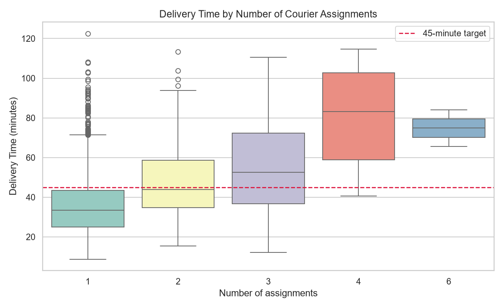
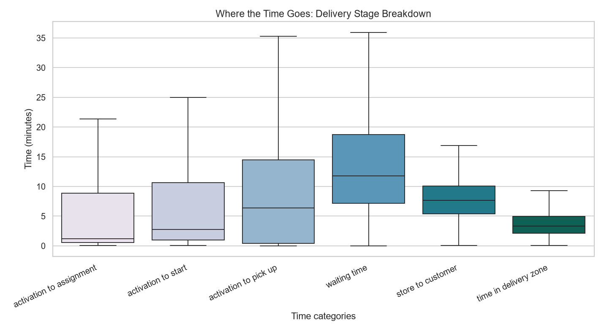
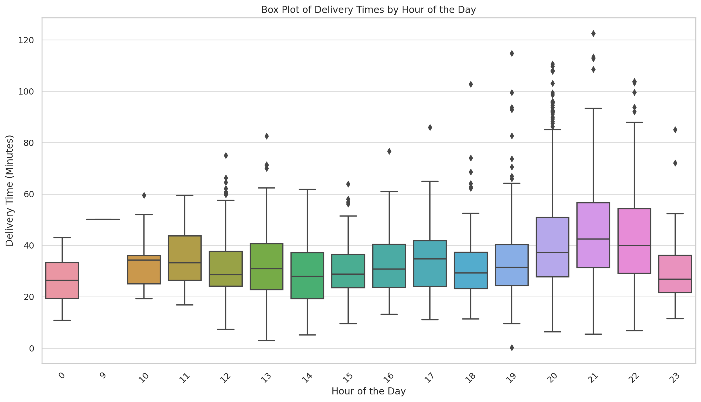
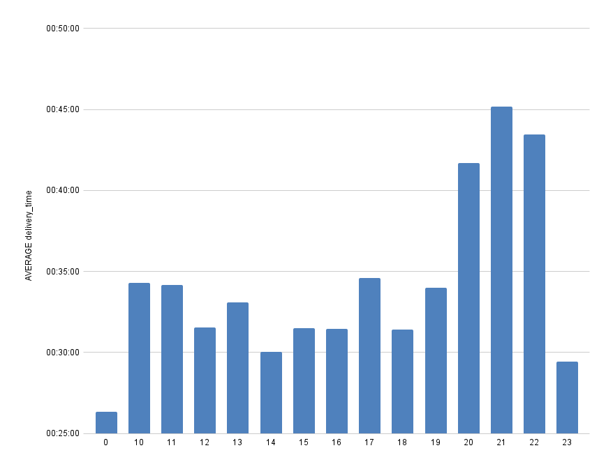

<p align="center">
  
</p>

# Glovo — Delivery Time Optimization

**Glovo aimed for 85% of deliveries within 45 minutes—but achieved only 73.47%.**

More than one in four deliveries missed the target, creating pressure on customer experience and operational efficiency.

The intuitive explanation was distance — longer trips, longer deliveries.

The intuitive fix would be to reduce the delivery radius or add more couriers. Both are among the most expensive changes a delivery platform can make.

Before recommending anything, I wanted to answer a simpler question:

Where does delivery time actually go?

Using operational data from 2,471 food deliveries, 83 couriers, and 68 restaurants, I decomposed every order into its individual stages to identify where time was being lost and which operational bottlenecks had the greatest impact.

---

## Investigation Approach

Rather than analysing delivery time as a single metric, I broke every delivery into its operational stages:

1. Order activation
2. Courier assignment
3. Courier acceptance
4. Travel to restaurant
5. Waiting at restaurant
6. Travel to customer
7. Final handoff

This allowed every minute of a delivery to be traced back to a specific operational process instead of treating delivery time as one black-box KPI.

Each hypothesis was then tested independently, including:

- Does delivery distance explain delays?
- Do courier reassignments increase delivery time?
- Which delivery stage consumes the most time?
- Are delays random or concentrated around predictable demand peaks?
- Which restaurants and couriers contribute disproportionately to cancellations?
- Does vehicle type influence delivery performance?

---

## Key Findings

### Finding 1 — Distance Wasn't the Main Bottleneck

The most intuitive explanation turned out to be one of the weakest.

Across all deliveries, distance showed only a **0.32 correlation** with total delivery time.

More importantly, when analysing only deliveries that exceeded the 45-minute SLA, that relationship collapsed to **0.02** — effectively no relationship at all.

If distance were truly driving poor performance, its influence should become stronger among late deliveries—not disappear entirely.

This ruled out one of the most expensive operational interventions before any recommendations were made.



The line on the left slopes. The line on the right is flat. Whatever makes an order late, it isn't the length of the trip.

### Finding 2 — Courier Reassignments Break the SLA (Service Level Agreement)

Every time an order changed couriers, delivery performance deteriorated significantly.

| Assignments | Average Delivery Time |
|---|---|
| 1 | 36 min |
| 2 | 47 min |
| 3 | 55 min |
| 4 | 80 min |

The second assignment alone pushed the average delivery beyond the platform's target.

Although only 13% of deliveries experienced a reassignment, those orders represented a disproportionate share of late deliveries and cancelled orders.

Rather than treating reassignment as an administrative event, the analysis identified it as one of the platform's highest-impact operational bottlenecks.



### Finding 3 — The Longest Part of Delivery Isn't Delivery

Breaking the process into individual stages revealed the most surprising insight.

| Delivery Stage | Median Time |
|---|---|
| Order → Courier Assigned | 1.2 min |
| Assignment → Courier Starts | 2.8 min |
| Travel to Restaurant | 6.4 min |
| **Waiting at Restaurant** | **11.8 min** |
| Restaurant → Customer | 7.6 min |
| Final Handoff | 3.3 min |

Couriers spent more time waiting inside restaurants than delivering food to customers.

That finding fundamentally changes where improvements should be made.

Unlike driving distance, restaurant waiting time represents operational waste.

Reducing that delay doesn't require additional couriers or smaller delivery zones—it requires better synchronization between restaurant preparation and courier arrival.



### Finding 4 — Delays Follow Demand

Delivery performance remained relatively stable throughout most of the day before deteriorating rapidly during the evening peak.

The pattern closely mirrored order volume.

Orders peaked between 19:00–21:00, while delivery times peaked shortly afterward, suggesting that operational capacity was consistently falling behind demand.

This indicates a scheduling problem rather than a routing problem.

Demand is predictable.

Courier availability wasn't.





### Finding 5 — Operational Problems Were Highly Concentrated

The analysis also showed that cancellations were far from evenly distributed.

Although the platform's cancellation rate was only 3.3%, nearly 40% of all cancellations originated from just two restaurants.

Rather than requiring platform-wide policy changes, this insight points toward highly targeted operational intervention.

Sometimes improving an entire network starts with fixing only a handful of outliers.

---

### Additional Investigation — Vehicle Type

Vehicle type was not the primary driver of delivery delays, but it revealed an interesting operational signal.

Cars showed longer average delivery times than motorbikes despite covering similar distances:

Vehicle Type	Average Delivery Time
Motorbike	58.6 min
Car	63.0 min

Cars also had a higher average reassignment rate:

Vehicle Type	Average Assignments
Motorbike	1.31
Car	1.45

The dataset cannot determine the exact reason behind this difference, but possible factors include parking limitations, reduced flexibility in dense urban areas, or different courier behaviour patterns.

This is a signal worth investigating further, but not enough evidence to justify a fleet-wide change without additional data.

---

## Recommendations

Based on the findings, I prioritized interventions according to expected business impact.

| Priority | Recommendation | Expected Impact |
|---|---|---|
| High | Reduce courier reassignments through improved matching and acceptance incentives | Highest |
| High | Synchronize restaurant preparation with courier arrival | Highest |
| Medium | Increase courier supply during evening peaks | Medium |
| Medium | Shift more deliveries toward motorbikes where appropriate | Medium |
| Low | Investigate restaurants with unusually high cancellation rates | Targeted |

---

## Estimated Impact

To evaluate how these interventions might combine, I created a simulation modelling sequential operational improvements.

| Stage | On-Time Delivery Rate |
|---|---|
| Current Performance | 73.47% |
| Reduce Reassignments | 76.43% |
| Improve Peak Staffing | 77.78% |
| Optimize Vehicle Allocation | 79.63% |
| Reduce Restaurant Waiting | 82.97% |
| Address Cancellation Outliers | 83.23% |
| Improve Initial Assignment | **84.63%** |

The simulation demonstrates relative impact rather than predicting exact outcomes.

Its purpose is to prioritize operational improvements, not replace real-world experimentation.

---

## Technical Highlights

This project demonstrates an end-to-end analytics workflow:

- Data cleaning and preprocessing with Python
- Feature engineering from timestamp data
- Process decomposition into operational stages
- Exploratory data analysis
- Correlation and bottleneck analysis
- Outlier detection
- Operational KPI reporting
- Business recommendation framework
- Scenario simulation

**Tools:** Python • pandas • NumPy • Matplotlib • Seaborn • Jupyter Notebook

---

## Repository

```bash
git clone https://github.com/niksaderek/Glovo---Delivery-Time-Optimization.git
cd Glovo---Delivery-Time-Optimization
pip install pandas numpy matplotlib seaborn openpyxl
jupyter notebook notebook.ipynb
```

The notebook reproduces every chart, metric, and recommendation presented in this case study directly from the provided dataset.

---

## Final Thought

This project isn't about food delivery.

It's about finding the constraint inside a system.

The obvious explanation—distance—wasn't wrong, but it wasn't the bottleneck either.

By decomposing the delivery process into measurable stages, the analysis identified where time was actually being lost, allowing operational improvements to be prioritized based on evidence rather than intuition.

That's the difference between reporting what happened and diagnosing why it happened.
