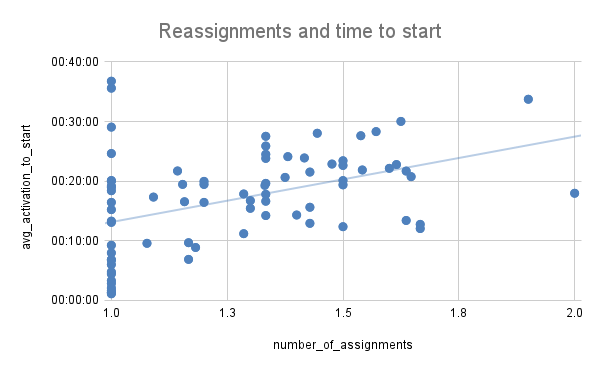
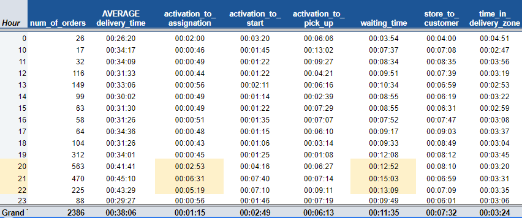
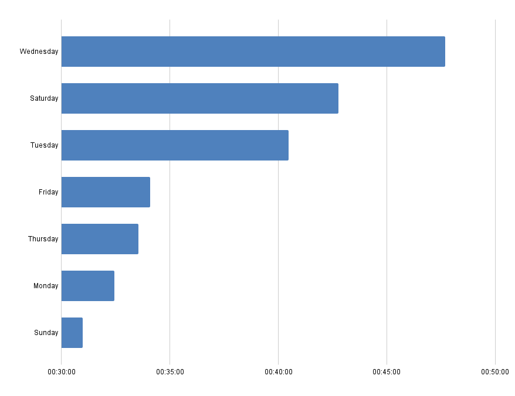
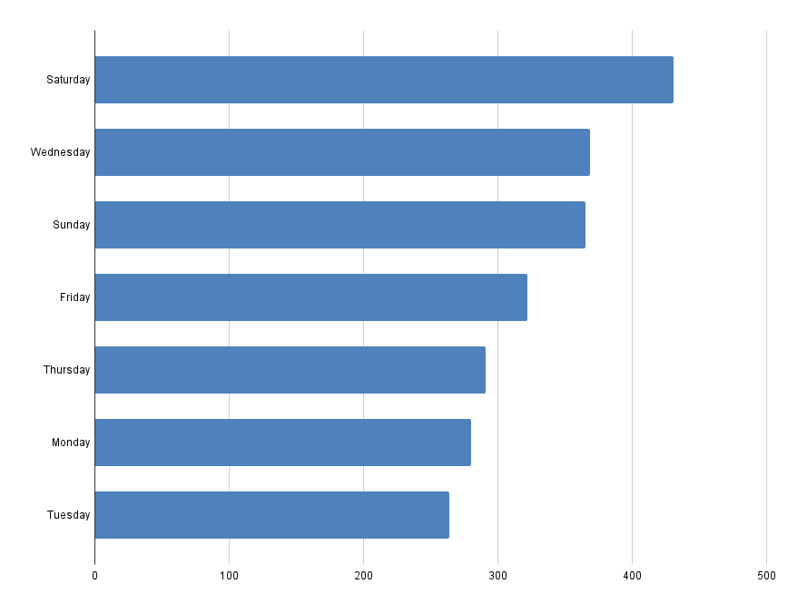
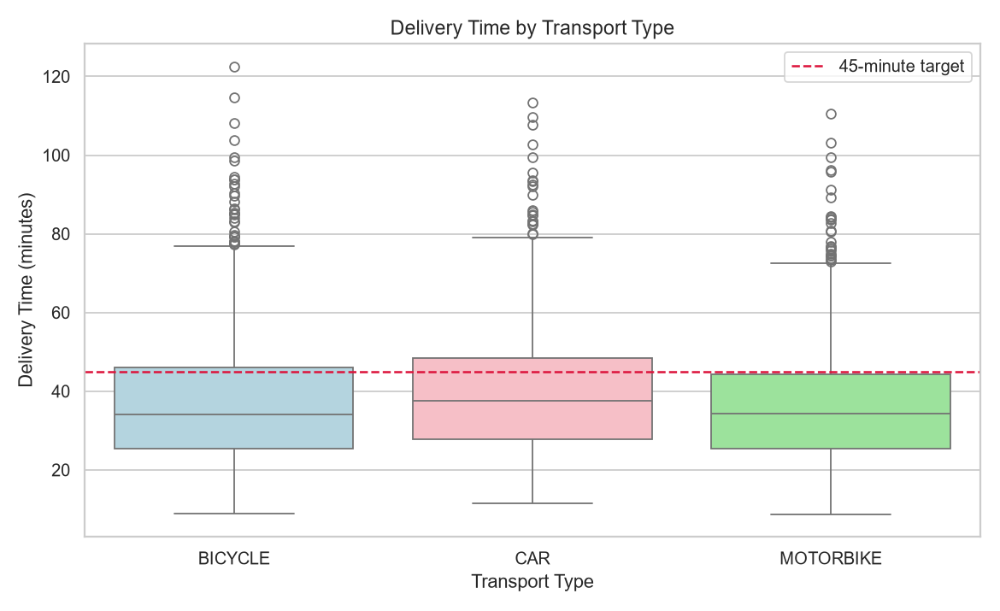
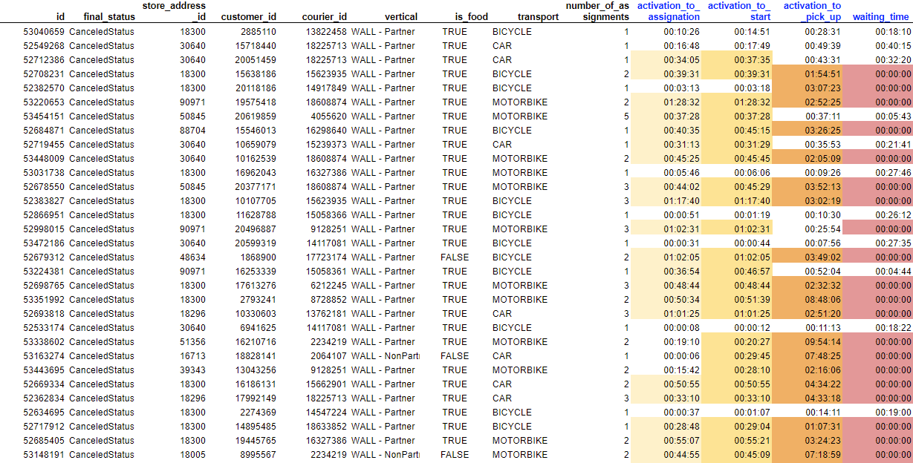

# Glovo — Delivery Time Optimization

**73% of food orders arrive in under 45 minutes. The target is 85%. Here is where the missing 12 points are hiding.**

An operational analysis of one week of Glovo food-delivery data in Glovalia — 2,471 orders, 83 couriers, 68 stores — that traces every minute of the delivery lifecycle, isolates the three bottlenecks that actually move the KPI, and turns them into a costed 4-week action plan with a week-by-week simulation.


*Delivery times hold steady all day, then blow out between 20:00 and 22:00 — the exact window carrying the most orders.*

---

## The Problem

Glovo's headline service KPI is the share of food orders delivered within 45 minutes of activation. In the week analysed, the operation hit **73.47%** against an **85%** target — a **11.53 point gap**, or roughly **270 late orders per week** in a single city.

The usual assumption is that late deliveries are a distance problem: couriers are simply travelling too far. The data does not support that. Distance correlates with delivery time at only **r = 0.32**, and among orders that actually breached 45 minutes the correlation *drops* to **0.23**. Distance is not what makes an order late.

What makes an order late is **coordination** — how fast a courier is matched, how many times the order is passed around, and how long the courier stands in the store waiting for food.

---

## See It Work

### 1. Reassignments are the single biggest lever

Every time an order is handed to a new courier, the clock resets. One assignment averages **36 minutes** — comfortably inside target. Two assignments averages **47 minutes** — outside it.


The median crosses the 45-minute line the moment a second courier gets involved, and keeps climbing.

| Assignments | Avg delivery time | Share of orders |
|---|---|---|
| 1 | 36 min | 86.9% |
| 2 | 47 min | 10.7% |
| 3 | 55 min | 2.1% |
| 4 | 80 min | 0.3% |
| 6 | 75 min | 0.1% |

Going from one assignment to two costs **+23.6% delivery time**. **318 orders (13.3% of the week)** missed the target with a reassignment attached. Reassignments also predict cancellations: cancelled orders averaged **1.46** assignments versus **1.17** across the board.

The upstream cause is visible too — the more a store's orders get reassigned, the longer they sit before a courier even starts:



### 2. Couriers spend most of their time waiting at pickup

Breaking the lifecycle into its six stages shows the delay is not on the road — it is in the store.


| Stage | Median | Read |
|---|---|---|
| Activation → assignment | 1.2 min | Fast when it works |
| Activation → courier start | 2.8 min | Long tail: 209 outliers |
| Activation → pickup arrival | 6.4 min | — |
| **Waiting at pickup** | **11.8 min** | **Largest single block** |
| Store → customer | 7.6 min | Actual travel |
| Time in delivery zone | 3.3 min | — |

**Waiting at pickup is the biggest block of time in the entire journey** — larger than the drive to the customer. That is store food-prep timing misaligned with courier arrival, and it is fixable without hiring a single extra courier.

Outlier counts point the same direction — the four worst offenders are all coordination stages, not travel: activation→start (209), activation→assignment (192), waiting time (188), time in delivery zone (182).

### 3. Demand pressure concentrates in a predictable window




Longest average delivery times fall between **20:00 and 23:00**; peak order volume falls between **19:00 and 21:00**. The strain is not spread across the day — it is a three-hour window.

The same holds weekly:





**Wednesday, Saturday and Tuesday** carry the highest mean and median delivery times. **Saturday, Wednesday and Sunday** carry the most orders. Courier supply should be scheduled against these peaks rather than spread evenly.

### 4. Transport mode has a measurable effect



| Transport | Avg delivery time | Avg assignments | Avg distance |
|---|---|---|---|
| Motorbike | 58.6 min | 1.31 | 7.23 km |
| Bicycle | 60.2 min | 1.30 | 4.97 km |
| Car | 63.0 min | 1.45 | 7.13 km |

*(Averages within the >45-minute cohort.)*

**Motorbikes cover the most distance in the least time.** **Cars are slowest and get reassigned most**, despite covering no more ground than motorbikes — likely parking and access friction in a dense town, though the data cannot confirm the mechanism. Prioritising motorbikes in peak windows is the low-cost move.

### 5. Cancellations cluster in a handful of stores



The cancellation rate is **3.32%** (82 of 2,471 orders) — acceptable against a 5% threshold, but not evenly distributed. Store **18300** alone accounts for 18 cancellations; together with store **30640** the two make up **39% of all cancellations**. Courier **16327386** accounts for 6. Cancelled orders are overwhelmingly ones where activation-to-pickup stretched into *hours* — the red columns above.

This is a named-account problem, not a systemic one. Two store conversations address 39% of it.

---

## The 4-Week Plan and Its Simulated Impact

Each intervention targets one bottleneck identified above and is introduced sequentially so its individual contribution stays measurable.

| Week | Intervention | Targets | Simulated KPI | Gain |
|---|---|---|---|---|
| — | Baseline | — | 73.47% | — |
| 1 | Reduce reassignments — better courier matching, acceptance incentives | Finding 1 | 76.43% | +2.96 |
| 2 | Peak-hour courier slots + dynamic pricing off-peak | Finding 3 | 77.78% | +1.35 |
| 3 | Shift car deliveries to motorbikes | Finding 4 | 79.63% | +1.85 |
| 4 | Cut pickup waiting — prep-time monitoring, courier arrival alignment | Finding 2 | 82.97% | +3.34 |
| 5 | Lower cancellation rates | Finding 5 | 83.23% | +0.26 |
| 6 | Reduce start-to-assignment time | Finding 2 | **84.63%** | +1.40 |

**Four weeks closes 9.5 points of the gap. Six weeks reaches 84.63% — within 0.4 points of target.**

The two interventions with the largest simulated payoff — reassignment reduction and pickup waiting — are precisely the two the exploratory analysis flagged as the dominant bottlenecks. The plan is not a list of generic best practices; each week is aimed at a specific measured defect.

> **On the simulation:** the week-by-week model runs 10,000 synthetic deliveries and applies improvement coefficients that are *chosen, not estimated from causal evidence*. It demonstrates the relative ordering and plausible magnitude of the levers — it is not a forecast. Establishing real effect sizes requires A/B testing in-market. This caveat is stated plainly rather than buried, because a stakeholder acting on these numbers needs to know which parts are measured and which are modelled.

---

## What the Analysis Deliberately Rules Out

Negative results matter as much as positive ones, and both were tested rather than assumed:

- **Distance is not the driver.** r = 0.32 overall, dropping to 0.23 among late orders. Capping courier travel distance would be an expensive intervention aimed at the wrong variable.
- **Partnership type does not matter.** WALL-Partner and WALL-NonPartner show near-identical delivery times. No commercial-tier explanation for lateness.
- **Verticals other than food are excluded**, along with cancelled orders — neither can be classified as under or over 45 minutes, so including them would distort the KPI.
- **Courier average is a usable early-warning signal.** Couriers averaging over 30 minutes are very likely in the >45-minute cohort — a simple monitoring threshold that needs no model.

---

## Reproduce It

```bash
git clone https://github.com/niksaderek/Glovo---Delivery-Time-Optimization.git
cd Glovo---Delivery-Time-Optimization
pip install pandas numpy matplotlib seaborn openpyxl
jupyter notebook notebook.ipynb
```

`DATA_1_BC.xlsx` (order-level fulfilment records) is included. Run the notebook top to bottom — the cleaning pipeline, KPI calculation and every figure regenerate from source.

---

## Method

The pipeline, in order:

1. **Load and normalise** — seven datetime fields parsed consistently so stage arithmetic is reliable.
2. **Handle missing values** — numeric and boolean fields filled at zero; `store_address_id` filled explicitly so orphaned orders remain countable rather than silently dropped.
3. **Scope to the question** — cancelled orders and non-food verticals removed, leaving **2,322 food deliveries** from 2,471 raw orders.
4. **Derive the KPI** — `delivery_time = termination_time − activation_time_local`; negative durations dropped as data errors.
5. **Decompose the lifecycle** — six stage durations computed per order to locate delay rather than merely measure it.
6. **Segment** — by assignment count, hour, weekday, transport, vertical, store and courier.
7. **Quantify outliers** — IQR method per stage to separate chronic drag from tail events.
8. **Simulate** — sequential weekly interventions against a synthetic 10,000-order population.

## Dataset

| Field | Description |
|---|---|
| `store_address_id` | Store associated with the order |
| `courier_id` | Last courier assigned |
| `vertical` | Order category / business vertical |
| `transport` | Vehicle type on final assignment |
| `number_of_assignments` | Courier reassignment attempts before completion |
| `total_real_distance` | Distance covered during fulfilment |
| `final_status` | `DeliveredStatus` / `CanceledStatus` |
| `is_food` | Food vertical flag |
| 7× timestamp fields | Activation, assignment, start, pickup entry, pickup, delivery-zone entry, termination |

**Scale:** 2,471 orders · 2,322 food deliveries · 83 couriers · 68 stores · 1 week.

## Stack

Python · pandas · NumPy · Matplotlib · seaborn · openpyxl · Jupyter

## Repository Layout

```
.
├── notebook.ipynb              # Full analysis, top to bottom
├── DATA_1_BC.xlsx              # Order-level fulfilment data
├── docs/images/                # Figures used in this README
└── README.md
```

---

*Analysis of an anonymised operational dataset, completed as a portfolio case study. Store and courier identifiers are pseudonymous integers; the data contains no personally identifying information.*
